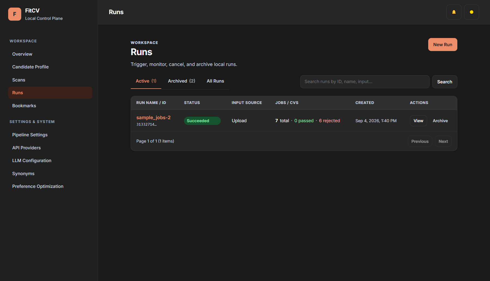
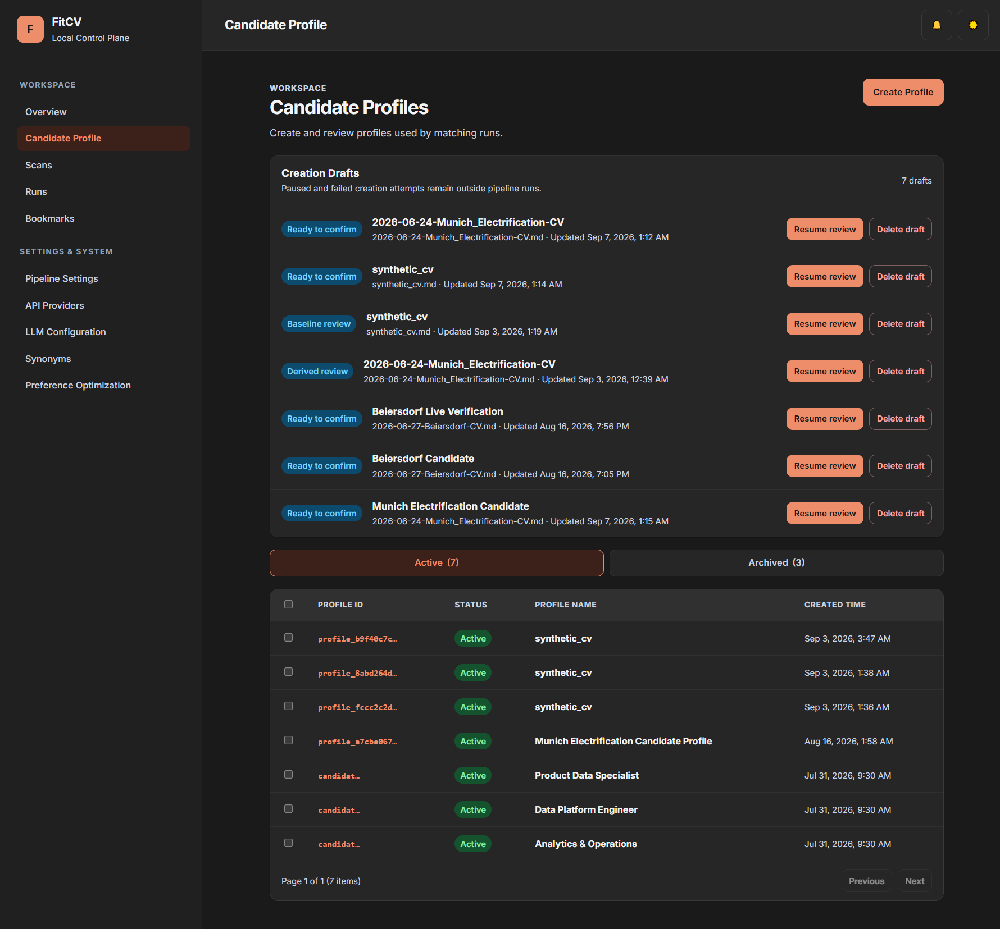
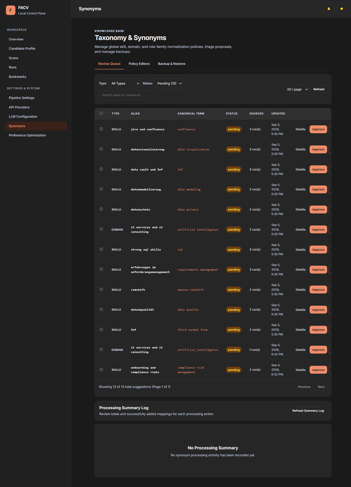
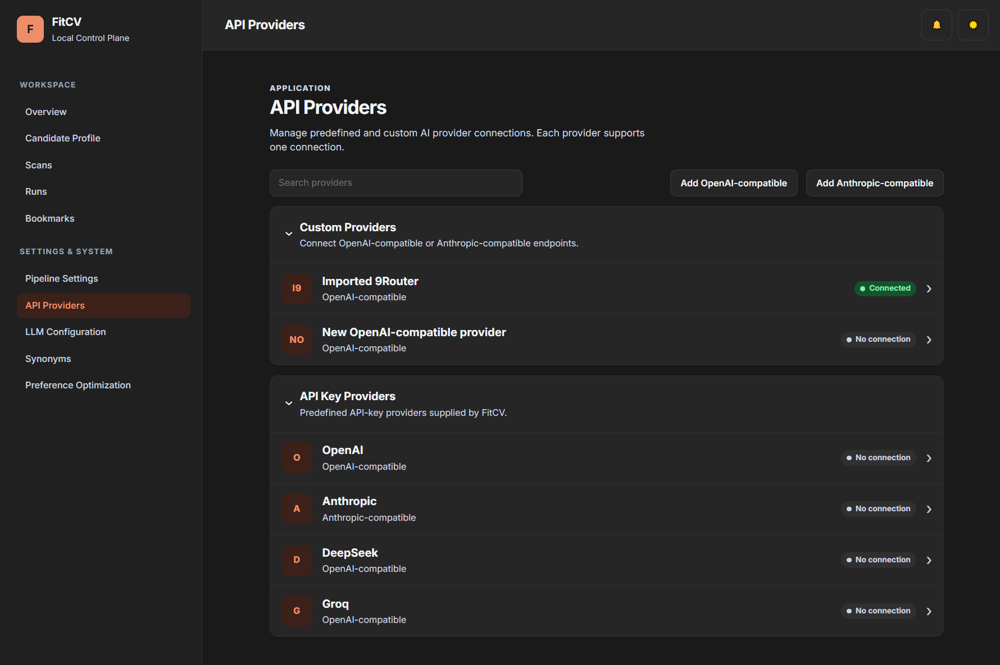
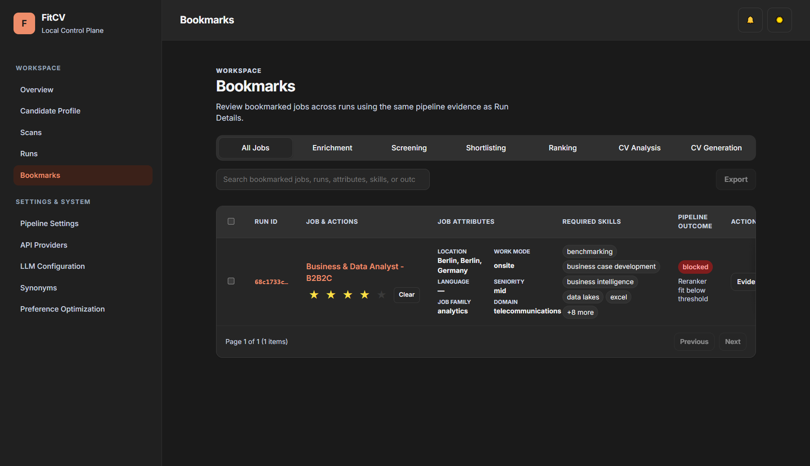

# FitCV

## Analyze job markets. Decide with evidence.

**FitCV turns raw job postings into a ranked, inspectable shortlist—and generates tailored CVs only when candidate evidence supports them.**

Instead of handing the entire job search to an LLM, FitCV separates deterministic filtering, retrieval, ranking, evidence checks, and generation into a traceable pipeline.

> **Find the pattern. See the evidence. Apply with intent.**

> **Technical Preview:** FitCV’s current workflows analyze the job data you bring in and expose ranking, evidence, gaps, and grounded outputs. Corpus-scale pattern reporting and supported batch size depend on source and runtime capacity.



## Why FitCV

- **Evidence-gated AI**: CV generation starts only after requirements are matched against candidate evidence.
- **Layered retrieval and ranking**: deterministic rules, semantic similarity, lexical signals, and configurable ranking narrow the search before expensive AI work.
- **Inspectability by design**: runs persist decisions, evidence, warnings, failures, and artifacts instead of hiding them behind a final score.
- **Cost-aware execution**: cheap filtering happens early; enrichment and generation focus on candidates worth deeper analysis.
- **Local or server deployment**: packaged FitCV Local supports non-technical Windows users while the control plane remains available for engineering workflows.

## Quick Start

**FitCV Local** is the primary path for non-technical Windows users. Install the
Technical Preview, launch it from Start, choose a user-owned data folder, complete
Candidate Profile and provider setup, then open **Runs** to submit job input.

Normal local use needs no Python, Git, Docker, Redis, separate worker, repository
checkout, terminal, or manually edited `.env` file. Detailed onboarding, backup,
recovery, troubleshooting, and developer setup live in
[docs/fitcv-control-plane-setup.md](docs/fitcv-control-plane-setup.md) and
[docs/setup.md](docs/setup.md).

## Job Data Input (LinkedIn, Indeed, Stepstone)

FitCV accepts source-shaped JSON arrays from LinkedIn, Indeed, and Stepstone.
LinkedIn remains supported through Apify actor `bebity/linkedin-jobs-scraper`.

FitCV ingestion expects a JSON file containing a top-level array of job objects
and loads it via `jobs_path` when triggering a run. Adapters detect source by
record shape, preserve raw input, and emit one canonical downstream shape.
Stepstone `textSnippet` records remain visible for review but do not produce a
CV until complete description text exists.

Single source of truth: [docs/job-data-input.md](docs/job-data-input.md).

Stage order:

`normalize → enrich → rule_filter → shortlist → ranking → cv_analysis → cv_generation`

## How It Works

1. **normalize** canonicalizes and deduplicates raw job postings.
2. **enrich** adds stable structured fields for matching and review.
3. **rule_filter** removes jobs that fail deterministic eligibility rules.
4. **shortlist** keeps plausible eligible jobs for deeper work.
5. **ranking** orders matches and exposes reviewable fit decisions.
6. **cv_analysis** checks evidence, gaps, and readiness; weak or unsupported jobs
   stop or require review.
7. **cv_generation** creates and validates grounded CV outputs only for ready jobs.
8. **Review artifacts**: inspect run ledgers, stage artifacts, diagnostics, and
   outputs. Filtered, blocked, failed, or review-required rows remain inspectable;
   they do not silently become CVs.

## Workflow Diagram


[Open the interactive Archify workflow](docs/fitcv-readme-workflow.html) ·
[View the canonical Archify source](docs/fitcv-readme-workflow.json)

Use **Follow one job** to trace a posting from raw input through preparation,
filtering, ranking, evidence checks, grounded output, and saved proof. Use **Why
this job?** to inspect how candidate evidence supports a ranked match. Use **Why
not this job?** to follow filtered or review-required outcomes without losing
their reason or evidence.

## Stage Methods (How Each Stage Works)

- **normalize**
  - Canonicalizes raw postings and removes exact or near-duplicate jobs while recording exclusions.

- **enrich**
  - Extracts stable structured fields through the routed LLM runtime, with pacing and SQLite reuse safeguards.

- **rule_filter**
  - Applies deterministic, config-driven eligibility gates and taxonomy-aware skill matching before expensive work.

- **shortlist**
  - Retrieves a bounded candidate/job shortlist with vector and lexical signals, cache reuse, and top-N controls; hybrid RRF fusion remains proposed.

- **ranking**
  - Combines fit, similarity, relevance, seniority, and preference signals with validated weights and taxonomy-aware neighbors.

- **Personalization optimization**
  - Optionally learns ranking preferences from ratings, validates policy proposals before activation, and never changes fit qualification truth.

- **cv_analysis**
  - Applies fit gates, retrieves supporting evidence, and reports requirement coverage and gaps before generation.

- **cv_generation**
  - Generates grounded structured CV output with configured templates, provider fallback, and validation/repair safeguards.

Detailed mechanics and contracts: [docs/FitCV-pipeline.md](docs/FitCV-pipeline.md) and [docs/pipeline.md](docs/pipeline.md).

## Screenshots









## Architecture

```text
Inputs (file/path/json)
  -> FastAPI control plane (src/fitcv_cp)
  -> FitCV Local serialized in-process execution
     or Redis + RQ server execution
  -> Core pipeline stages (src/fitcv)
  -> Persistent run state + artifacts
  -> Admin inspection/download surfaces
```

Primary architecture references:

- [docs/architecture.md](docs/architecture.md)
- [docs/fitcv-control-plane-setup.md](docs/fitcv-control-plane-setup.md)
- [docs/pipeline.md](docs/pipeline.md)

## Tech Stack

- Python 3.11, FastAPI, Jinja2 templates
- Serialized FitCV Local execution; Redis + RQ for developer/server deployment
- Config SSOT + compatibility bridging (`config/env.yaml`, `config/runtime/*`)
- SQLite + BigQuery backend adapters
- Test suite for config/contracts and control-plane behaviors

## Developer Setup

Python, Docker, Redis, and RQ remain supported engineering deployment choices:

```powershell
docker compose up -d --build redis web worker
```

Read [docs/setup.md](docs/setup.md) and
[docs/fitcv-control-plane-setup.md](docs/fitcv-control-plane-setup.md).

## Project Status

FitCV Local is an unsigned **Technical Preview**. Stable public release waits for
code signing and clean-Windows-VM acceptance; corpus-scale reporting and supported
batch size depend on source and runtime capacity.

## Docs Index

| Topic | Doc |
|---|---|
| Setup / runbook | [docs/fitcv-control-plane-setup.md](docs/fitcv-control-plane-setup.md) |
| Setup (quick) | [docs/setup.md](docs/setup.md) |
| Usage | [docs/usage.md](docs/usage.md) |
| API | [docs/api.md](docs/api.md) |
| Architecture | [docs/architecture.md](docs/architecture.md) |
| Component boundaries | [docs/component_boundaries.md](docs/component_boundaries.md) |
| Configuration | [docs/configuration.md](docs/configuration.md) |
| Pipeline (contract-ish) | [docs/pipeline.md](docs/pipeline.md) |
| Pipeline (story) | [docs/FitCV-pipeline.md](docs/FitCV-pipeline.md) |
| Observability | [docs/observability.md](docs/observability.md) |

