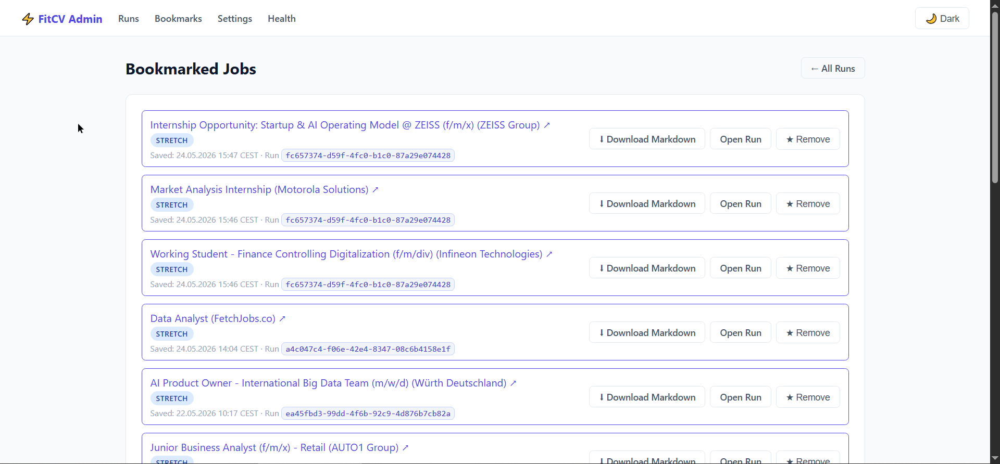

# FitCV

> Evidence-first job matching + CV generation, backed by operator control plane.

FitCV helps people turn noisy job postings into a reviewable shortlist and grounded
CV outputs. It narrows work in stages, keeps decisions inspectable, and stops safely
when evidence is missing or a result needs human review.

## FitCV Local

FitCV Local is the primary path for non-technical Windows users. It keeps the
candidate profile, settings, run history, artifacts, exports, logs, and backups
under a user-owned local data folder.

### Install and onboard

1. Get `FitCV-Local-<version>-Technical-Preview-Setup.exe` from your FitCV
   distribution and run it.
2. Launch **FitCV Local** from the Start menu. The browser opens local onboarding.
3. Choose a fixed local data folder. Do not use a network, UNC, removable, or
   unwritable location.
4. Open **Candidate Profile** and create or review a source-backed profile.
5. Open **API Providers**, select OpenAI, an OpenAI-compatible provider, or
   9router, then enter the API root, authentication details, API key when
   required, and wire API (`Responses` or `Chat Completions`).
6. Use **Discover models**, add or select at least one model, and use **Test
   provider**. FitCV does not enable run submission until provider readiness passes.
7. In **LLM Configuration**, select the **Default Route** model. Add task-specific
   models only when needed.
8. Review whole-run retry and optional bounded task prompt guidance, then select
   **Finish Setup**.

Normal FitCV Local use needs no Python, Git, Docker, Redis, separate worker,
repository checkout, terminal, or manually edited `.env` file. Current Windows
artifact is unsigned and explicitly labeled **Technical Preview**. Stable public
release waits for code signing and clean-Windows-VM acceptance.

### Run a workflow

1. Open the **Runs** page (`/admin/runs`).
2. Submit job input by path, upload, or paste, then choose **Run All** or
   **Stage by Stage**.
3. Wait for progress and open run details. FitCV processes jobs through
   `normalize`, `enrich`, `rule_filter`, `shortlist`, `ranking`, `cv_analysis`,
   and `cv_generation`.
4. Review ranked jobs, fit decisions, evidence, warnings, and next actions.
5. Open stage artifacts and exports when you need to verify why a job was kept,
   filtered, blocked, failed, or held for review. Download generated CV output
   only after reviewing it.

FitCV keeps filtered, blocked, failed, and review-required rows inspectable. They
do not silently become CVs. A second packaged run waits until the active run ends.

### Back up and recover

Open **Data & Backup** when the workspace is idle:

- **Download Backup** creates a validated `.fitcv.zip` backup.
- **Import Backup** validates the archive and restarts FitCV to finish the import.
- Cold data relocation moves the local workspace and also requires a restart.

Common fixes:

| Problem | Recovery |
|---|---|
| Provider test fails | Recheck API root, API key, selected wire API, and model; save changes and test again. |
| Run cannot start | Finish candidate profile setup, add a validated model, configure required credentials, and pass provider test. |
| Run says workspace is busy | Wait for the active run to finish; submit one packaged run at a time. |
| Local data cannot open | Close FitCV, make the selected folder available and writable, then launch FitCV again. Existing data is retained. |
| FitCV stopped | Close the stopped browser tab, then launch FitCV Local again from Start. |
| Data looks wrong or is missing | Restore the latest validated backup from **Data & Backup**. |

Use **System** to download redacted diagnostics when support needs startup,
storage, readiness, or provider-routing details. Diagnostics exclude API keys,
authorization headers, profile content, prompts, job descriptions, CV text, and
raw database rows.

## Who FitCV Serves

FitCV serves job seekers and workflow owners who need repeatable job matching,
inspectable decisions, and CV outputs grounded in candidate evidence.

- **FitCV Local users**: non-technical Windows users who configure a candidate
  profile and provider, run jobs, review matches and artifacts, and decide what to
  use. They do not need Python, Git, Docker, Redis, or a terminal.
- **Developers and operators**: people who run or maintain server deployments,
  pipeline logic, settings, provider routing, and run infrastructure. They inspect
  stages, events, diagnostics, and artifacts through the control plane.

## What It Does

- Ingest many job posts
- Normalize + enrich to stable structured fields
- Filter weak candidates before expensive work
- Rank best jobs with explainable outcomes
- Analyze readiness + evidence
- Generate CV outputs with validation/repair safeguards
- Persist artifacts so operator can inspect what happened

## Job Data Input (LinkedIn via Apify)

Primary upstream source: scraped LinkedIn job posts produced by Apify actor
`bebity/linkedin-jobs-scraper`.

FitCV ingestion expects a JSON file containing a top-level array of job objects
(the actor’s output shape) and loads it via `jobs_path` when triggering a run.

Single source of truth: [docs/job-data-input.md](docs/job-data-input.md).

Stage order:

`normalize → enrich → rule_filter → shortlist → ranking → cv_analysis → cv_generation`

## Workflow

1. **normalize** canonicalizes and deduplicates raw job postings.
2. **enrich** adds stable structured fields for matching and review.
3. **rule_filter** removes jobs that fail deterministic eligibility rules.
4. **shortlist** keeps plausible eligible jobs for deeper work.
5. **ranking** orders matches and exposes reviewable fit decisions.
6. **cv_analysis** checks evidence, gaps, and readiness; weak or unsupported jobs
   stop or require review.
7. **cv_generation** creates and validates grounded CV outputs only for ready jobs.
8. **Review artifacts**: inspect run ledgers, stage artifacts, diagnostics, and
   outputs. Filtered, blocked, failed, or review-required rows remain inspectable;
   they do not silently become CVs.

[Explore the workflow diagram](docs/fitcv-readme-workflow.html).

## Archify Workflow Artifact

The workflow diagram is the canonical Archify artifact for this README:

- [Open the rendered Archify workflow](docs/fitcv-readme-workflow.html)
- [Open the canonical Archify source](docs/fitcv-readme-workflow.json)

Use **Follow one run** to trace jobs from input through persisted artifacts,
**Inspect before output** to focus on ranking and evidence review, and **See safe
stops** to follow filtered, blocked, failed, or review-required rows.

## Why It’s Different

- **Evidence-first pipeline**: stage outputs are stage-owned truth; UI shows derived views.
- **Operator control plane**: trigger runs, inspect stages/items, download artifacts, manage lifecycle.
- **Cost control by design**: narrowing happens in layers; late-stage work gated by readiness.
- **Portability**: sqlite and bigquery backends aim to preserve same operator-visible contracts.
See deep stage behavior in [docs/FitCV-pipeline.md](docs/FitCV-pipeline.md) and [docs/pipeline.md](docs/pipeline.md).

## Stage Methods (How Each Stage Works)

- **normalize**
  - whitespace normalization + key canonicalization
  - exact dedupe by `job_url`
  - near-dedupe by `(company_id, title, sha256(description))` (keeps first, records exclusions)

- **enrich**
  - LLM structured extraction (prompt render + runtime model routing)
  - global request pacing (rate slot) to reduce provider throttling
  - sqlite cache for reused structured jobs (reuse status + contract fingerprint)

- **rule_filter**
  - deterministic gates before embeddings/LLM cost
  - config-driven signals (seniority, location/contract/experience excludes, must-have skills, domain prefs)
  - synonym canonicalization for skills (taxonomy-aware matching)

- **shortlist**
  - candidate+job embedding retrieval (`embeddings.py`)
  - vector shortlist with similarity scoring (cosine)
  - deterministic lexical BM25 query-term payload from canonical candidate components (`config/shortlist_lexical.yaml`)
  - shortlist debug hashes (`components_hash`, `canonical_text_hash`, `bm25_terms_hash`, `protected_terms_hash`) for invariance/symmetry evidence
  - query embedding cache + contract fingerprint (reuse vs fresh)
  - top-N controls (`vector_search_top_n`, retrieval strategy)
  - note: hybrid retrieval fusion (`vector + bm25 + rrf`) remains proposed and is not yet runtime-enabled on main

- **ranking**
  - weighted ensemble over features: `ai_score`, `must_have_match`, `vector_similarity`, `title_relevance`, `seniority_fit`, `preference_fit`
  - configurable weights + safe missing-value defaults (validated contract)
  - taxonomy-aware neighbors (domain / role-family proximity)

- **cv_analysis**
  - fit gate from ranking (`strong/stretch/skip`) blocks weak jobs
  - evidence retrieval + selection: lexical + optional embedding similarity
  - quotas + trimming (top-k per evidence type, bullet/highlight limits)
  - gap analysis + requirement coverage summary (what missing, what supported)

- **cv_generation**
  - structured JSON generation via OpenAI-compatible API (`responses` preferred, fallback `chat/completions`)
  - template variants by `job_family`, section composition from config
  - validation: required sections present, placeholder detection, grounding/consistency checks
  - one internal LLM runtime owns provider routing, transport fallback, normalized failures, and safe provenance

## Major Features and Engineering Highlights

- **Control-plane run operations**: trigger runs, inspect stages/items, stop/archive lifecycle actions.
- **Settings-driven execution**: persistent settings applied through control-plane settings store.
- **Artifact-backed observability**: run/item diagnostics and downloadable outputs.
- **Reuse/performance safeguards**: bounded reuse in selected stages to reduce redundant work.
- **Generation safety**: validation and deterministic repair path for low-risk output defects.
- **Bookmarks**: save jobs from run detail and review later at `/admin/bookmarks` (persists across runs).

Related docs:

- [docs/api.md](docs/api.md)
- [docs/architecture.md](docs/architecture.md)
- [docs/component_boundaries.md](docs/component_boundaries.md)
- [docs/configuration.md](docs/configuration.md)
- [docs/observability.md](docs/observability.md)

## Demo

FitCV Local opens browser automatically. Reopen current instance from Start menu,
or use its loopback URL shown by installed application.

Developer/server mode uses:

```text
http://localhost:8000/admin/runs
```

Bookmark flow:

- open run detail → Pipeline Results
- click star to save/remove
- review saved list at `http://localhost:8000/admin/bookmarks`

## Screenshots





## Architecture

```text
Inputs (file/path/json)
  -> FastAPI control plane (src/fitcv_cp)
  -> FitCV Local serialized in-process execution
     or Redis + RQ server execution
  -> Core pipeline stages (src/fitcv)
  -> Persistent run state + artifacts
  -> Admin inspection/download surfaces
```

Primary architecture references:

- [docs/architecture.md](docs/architecture.md)
- [docs/fitcv-control-plane-setup.md](docs/fitcv-control-plane-setup.md)
- [docs/pipeline.md](docs/pipeline.md)

## Tech Stack

- Python 3.11, FastAPI, Jinja2 templates
- Serialized FitCV Local execution; Redis + RQ for developer/server deployment
- Config SSOT + compatibility bridging (`config/env.yaml`, `config/runtime/*`)
- SQLite + BigQuery backend adapters
- Test suite for config/contracts and control-plane behaviors

## Getting Started

### FitCV Local

- Windows 11 or supported Windows 10
- Internet access only when selected LLM provider requires it
- Provider API key when selected provider requires authentication

Install Technical Preview, launch from Start menu, and complete browser onboarding.
User database, candidate profile, controller overlay, artifacts, exports, logs, and
backups stay under selected user-owned data folder.

### Developer / Server

Python, Docker, Redis, and RQ remain supported engineering deployment choices:

```powershell
docker compose up -d --build redis web worker
```

Read [docs/setup.md](docs/setup.md) and
[docs/fitcv-control-plane-setup.md](docs/fitcv-control-plane-setup.md).

## Docs Index

| Topic | Doc |
|---|---|
| Setup / runbook | [docs/fitcv-control-plane-setup.md](docs/fitcv-control-plane-setup.md) |
| Setup (quick) | [docs/setup.md](docs/setup.md) |
| Usage | [docs/usage.md](docs/usage.md) |
| API | [docs/api.md](docs/api.md) |
| Architecture | [docs/architecture.md](docs/architecture.md) |
| Component boundaries | [docs/component_boundaries.md](docs/component_boundaries.md) |
| Configuration | [docs/configuration.md](docs/configuration.md) |
| Pipeline (contract-ish) | [docs/pipeline.md](docs/pipeline.md) |
| Pipeline (story) | [docs/FitCV-pipeline.md](docs/FitCV-pipeline.md) |
| Observability | [docs/observability.md](docs/observability.md) |

